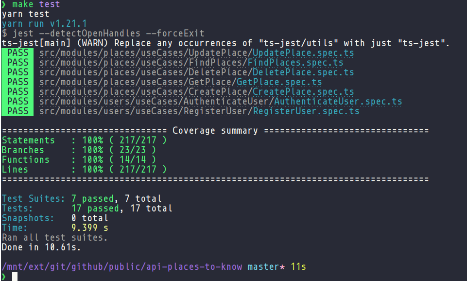

# Api Places To Know

## Sobre

> Api Rest Desenvolvida em NodeJs, com objetivo de gerar um banco de dados de fotos de locais pelo mundo. Os detalhes do projeto são a integração com uma API externa, criação de uma busca com filtro e paginação. <br /> 👉 <a href="http://143.198.112.106:3021/api-docs"> Link do swagger</a>

## Paths

### Login do user

👉 http://143.198.112.106:3021/login (POST)

```json
{
    "email": "admin@admin.com",
    "password": "G1rafarosa#"
}
```

### Registro de user

👉 http://143.198.112.106:3021/users (POST)

```json
{
    "name": "Tiago Rizzo",
    "email": "tiago@gmail.com",
    "password": "T1ag0rizzo#"
}
```

### Cria o local

👉 http://143.198.112.106:3021/places (POST)

```json
{
    "name": "Roma"
}
```

### Atualiza o local

👉 http://143.198.112.106:3021/places/{id} (PUT)

```json
{
    "name": "Portugal"
}
```

### Filtra locais

👉 http://143.198.112.106:3021/places?page=1&limit=10&search=a&order=name (GET)

```json
{}
```

### Mostra detalhes de um local

👉 http://143.198.112.106:3021/places/{id} (GET)

```json
{}
```

### Deleta um local

👉 http://143.198.112.106:3021/places/{id} (DELETE)

```json
{}
```

## Recursos utilizados

<p align="left">
  
  
  
  
</p>

-   Swagger
-   Typescript
-   Docker / Docker compose
-   Arquitetura Feature By Package
-   Conceitos do DDD, como repository, providers, modules e etc.
-   Framework Express
-   Testes com coverages (Jest)
-   Serviço Sentry para catalogar errors
-   TypeOrm
-   JWT
-   Assincronismo de errors
-   Injeção de dependência com a biblioteca tsyringe
-   Babel para build, resolvendo o problema dos paths
-   Criação de seed para criar o user Admin
-   Helmet
-   Morgan
-   Validação nos DTOs com a biblioteca class-validator
-   Padrões de projeto (Chain of responsability, Strategy, Adapter, Factory)
-   Gitflow (develop/master/main)
-   Utilização de padronização de commits (convetional commits)
-   Makefile

## Vantagens da arquitetura Feature By Packages

-   **Manutenção**: Facilita o engajamento de multiplas equipes e colaboradores em um projeto;
-   **Escalável**: Facilita refatoramento do código monolítico para uma uma estrura de microserviços;
-   **SOLID**: Facilita a aplicação de todos os princípios do SOLID;
-   **Git**: Melhora o gerenciamento dos commits, evitando conflitos e etc;
-   **Testes**: Facilita o desenvolvimento de testes de unidade e integração.

### Places - Estrutura de pastas e arquivos módulo

```
├── containers
│   └── index.ts
├── dtos
│   ├── CreatePlaceDTO.ts
│   ├── FindBasePlaceDTO.ts
│   ├── FindPlaceDTO.ts
│   ├── GetPlaceDTO.ts
│   ├── ReponseListPlacesDTO.ts
│   ├── ReponsePlaceDTO.ts
│   └── UpdatePlaceDTO.ts
├── helpers
│   └── combStringHelper.ts
├── infra
│   ├── routes
│   │   └── PlaceRoutes.ts
│   └── typeorm
│       └── mongo
│           ├── repositories
│           │   └── PlaceMongoRepository.ts
│           └── schemas
│               └── PlaceMongoSchema.ts
├── providers
│   ├── index.ts
│   └── PhotoStock
│       ├── implements
│       │   └── UnPlashProvider.ts
│       ├── inMemory
│       │   └── PhotoStockProviderInMemory.ts
│       ├── PhotoStockProviderStrategy.ts
│       └── PhotoStockProvider.ts
├── repositories
│   ├── inMemory
│   │   └── PlaceRepositoryInMemory.ts
│   └── PlaceRepository.ts
├── schemas
│   ├── inMemory
│   │   └── PlaceInMemory.ts
│   └── Place.ts
└── useCases
    ├── CreatePlace
    │   ├── CreatePlaceController.ts
    │   ├── CreatePlaceMiddleware.ts
    │   ├── CreatePlaceService.ts
    │   ├── CreatePlace.spec.ts
    │   └── CreatePlaceValidator.ts
    ├── DeletePlace
    │   ├── DeletePlaceController.ts
    │   ├── DeletePlaceMiddleware.ts
    │   ├── DeletePlaceService.ts
    │   ├── DeletePlace.spec.ts
    │   └── DeletePlaceValidator.ts
    ├── FindPlaces
    │   ├── FindPlacesController.ts
    │   ├── FindPlacesMiddleware.ts
    │   ├── FindPlacesService.ts
    │   ├── FindPlaces.spec.ts
    │   └── FindPlaceValidator.ts
    ├── GetPlace
    │   ├── GetPlaceController.ts
    │   ├── GetPlaceMiddleware.ts
    │   ├── GetPlaceService.ts
    │   ├── GetPlace.spec.ts
    │   └── GetPlaceValidator.ts
    └── UpdatePlace
        ├── UpdatePlaceController.ts
        ├── UpdatePlaceMiddleware.ts
        ├── UpdatePlaceService.ts
        ├── UpdatePlace.spec.ts
        └── UpdatePlaceValidator.ts
```

## Outras informações

O projeto tem como gerencimento de pacotes o **Yarn** e o **Makefile** como automação de comandos, além disso, o MongoDB é um container do **Docker**.

## Testes com coverages reports



## Instruções para rodar a API

### Pré-requisitos

-   NodeJs v12.22.9
-   Yarn v1.21.1
-   Docker v20.10.12, build e91ed57
-   Docker compose v1.29.2, build 5becea4c
-   Makefile para rodar os aliases

### Passo a passo

```bash
# Para clonar repositório
git clone https://github.com/venzel/api-places-to-know.git

# Para entrar na pasta do projeto
cd api-places-to-know

# Renomear arquivo .env.example para .env
cp -r .env.example .env

# Inserir as variáveis de ambiente no arquivo .env
# Para gerar a o SENTRY_DSN: https://sentry.io/
# Para gerar os TOKEN_SECRET e TOKEN_SECRET_REFRESH http://www.md5.cz/
SENTRY_DSN=
TOKEN_SECRET=
TOKEN_SECRET_REFRESH=

# Para instalar os pacotes
make install

# Para rodar os testes
make test

# Para subir o container do mongodb na porta 27017
make up

# Para rodar as seeds do projeto (email: admin@admin.com, senha: G1rafarosa#)
make seed

# Para executar o projeto na porta 3010
make run
```
